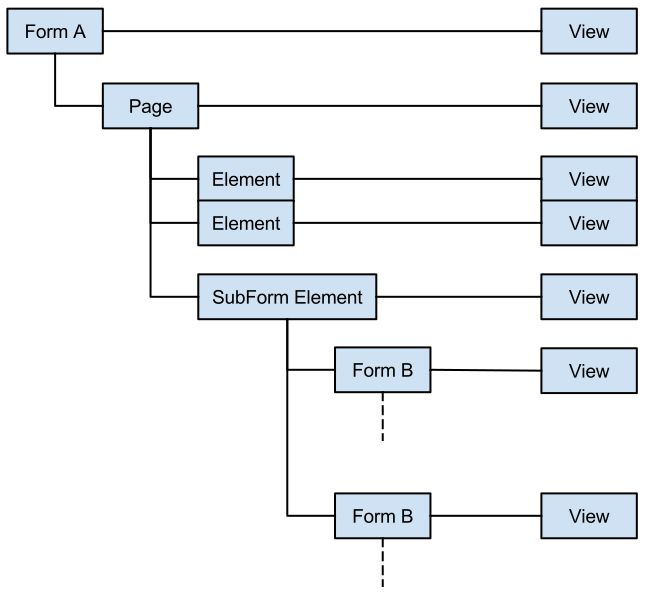

# Forms: Object Graph with SubForms

For general descriptions of these components, see the [glossary](glossary.md).

## SubForm

There is no meaningful distinction between Form and SubForm definitions.

At runtime, a SubForm is a special Form that is directly related to its parent
SubForm Element.

Whilst SubForms technically have Pages, our pagination functionality is strictly
enabled for the top-most (i.e. root) Form.

## SubForm Element

This is a special interactive Element that imports another Form definition for
inclusion in the parent Form definition.

This is the intermediary between the outer Form and the inner SubForm instances.

All SubForm instances within a SubForm Element must share the same definition.

## SubRecord

Depending on the way you persist / process your data, it may be useful to refer
to the data captured specifically using SubForm Elements and SubForms.

A SubRecord is the data captured by a specific instance of a SubForm. Thus, a
single SubForm Element may result in zero or more SubRecords.

## Deeply-Nested SubForms

You may define a Form that contains a SubForm Element importing a SubForm, that
in turn contains a SubForm Element, and so on.

Avoid circular references. Further, overuse of this functionality may lead to
poor performance on devices, and/or poor usability.
