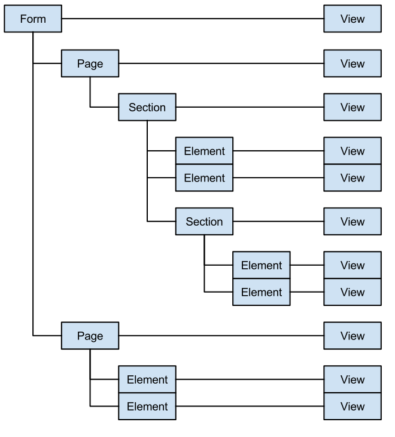

# Forms: Object Graph

For general descriptions of these components, see the [glossary](glossary.md).

## Models

These are the canonical source of truth for the state of the Form. These are
the ideal targets for custom code that needs to act on data.

Models are often directly related to other Models, and to Views.

## Views

These are disposable, and are the intermediaries between the Models and humans.

Generally, Views are not directly related to other Views.
